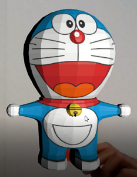
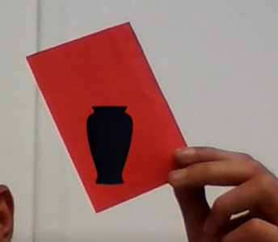
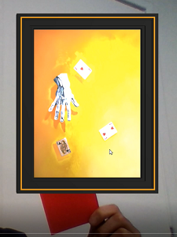

# Simple Video Assistant

This project was created for the ”Computer Vision” exam held in the year 2017/2018 in Polytechnic of Turin.The idea was to create a visual assistant that can answer to a user through a webcam using Augmented Reality (AR), exploiting the computer vision’s technique learned in the course and exploring the world of ”three.js”.

To  use  the  application  the  user  should  hold  a  red  target,  or  better  leave  it  somewhere and ask the assistant to show him a vase, a painting or its identity.  After he should go to the browser and see which is the answer.

